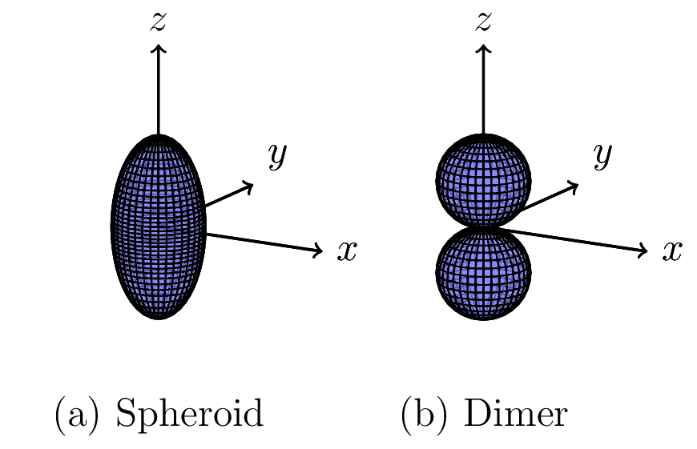
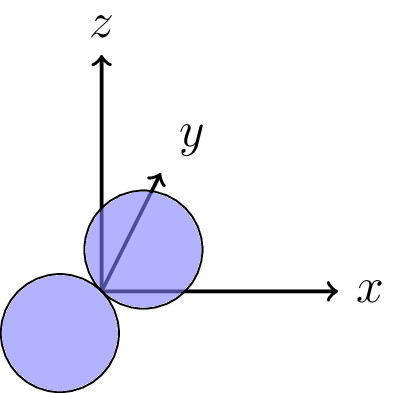

.. _bd_tutorial:

Simulating Brownian Dynamics: simple cases
==========================================

Overview
--------
A particle suspended in a fluid (such as a pollen grain in water, viewed under a microscope) appears to jiggle randomly.
This is *Brownian motion*.
It occurs because the constantly-moving molecules in the fluid collide with the particle. The details depend on the interplay between these random collisions
and the fluid drag forces on the particle.

brownian_ot simulates this behavior, both for a freely diffusing particle
(that experiences no external forces) as well as for a particle experiencing
forces including the optical forces exerted by optical tweezers.
The simulations are based on the Langevin equation in the limit where the
inertia term is negligible. Notably, this ignores ballistic behavior on
timescales much shorter than the particle's relaxation time :math:`m/\gamma`,
where :math:`m` is the particle's mass and :math:`\gamma` is its friction
coefficient. See Fernandes and Garcia de la Torre [Fernandes2002]_ for details.

A freely diffusing sphere
-------------------------
Particles in brownian_ot are described by `Particle` objects.
There are pre-defined objects corresponding to widely-used particles.
Begin with the relevant imports:

.. testcode::

   import numpy as np
   from brownian_ot.particles import Sphere
   from brownian_ot.simulation import FreeDiffusionSimulation

Next, instantiate a `Sphere` object. Here, `a` is the radius of the sphere.
brownian_ot can work in any self-consistent set of units, with one exception:
the optical force calculations assume standard SI units by default (but this
can be overridden if desired). Here, we'll assume a 1-micrometer-radius
particle and work in SI units:

.. testcode::

   sphere = Sphere(a = 1e-6)

Similarly, simulations are run via a `Simulation` object, with common use cases
available via pre-defined subclasses. Here, since we're simulating a
freely-diffusing particle, we'll instantiate a `FreeDiffusionSimulation` object:

.. testcode::

   sim = FreeDiffusionSimulation(sphere, 5e-5, 1e-3, 1.38e-23 * 295)

The first argument is the sphere whose motion we are simulating.
The second argument is the simulation timestep, which is 50 microseconds here.
The third argument
is the solvent viscosity, which is here 1 mPa s. This corresponds to
water at room temperature. The third argument is the
system's temperature expressed as a thermal energy scale: :math:`k_BT`,
where :math:`k_B` is Boltzmann's constant.

By default, the particle's initial position is at the origin. While for a
uniform sphere, the particle's orientation can't be tracked in an experiment,
changes in the particle's orientation as a result of rotational diffusion are
tracked by brownian_ot. The default initial orientation is specified by the
:math:`3 \times 3` identity rotation matrix. Sometimes, we might want
to specify different values. This can be done as follows:

.. testcode::

   sim = FreeDiffusionSimulation(sphere, 1e-5, 1e-3, 1.38e-23 * 295,
                                 pos0 = np.array([-1, 0.5, -0.7]) * 1e-6,
				 orient0 = np.array([[1, 0, 0],
                                                    [0, -1, 0],
				                    [0, 0, -1]]),
			         seed = 123456789)

Here, the sphere begins at coordinates :math:`(-1, 0.5, -0.7)` micrometers
and turned upside-down via a rotation about the :math:`x` axis.
The final keyword argument is an optional seed to the NumPy random number
generator [1]_, which you should specify if you want your simulation to be
reproducible.

The simulation can now be run:

.. testcode::

   traj = sim.run(1000)

This runs the simulation for 1000 time steps. The output, `traj`, is an ndarray:

..  testcode::

    print(traj.shape)
   
..  testoutput::
    
    (1001, 7)

The first row is the particle's initial position and orientation, and the
subsequent rows are the position at orientation after each time step. Within
each row, the first 3 elements are the particle's position, and the last 4
elements are the particle's orientation specified as a quaternion.

Since `traj` is an ndarray, you can now manipulate it via any of NumPy's
functions and methods. Most of the time, particulary when running long
simulations, you will want to save the output. You can automatically save
the output if you specify the optional `fname` argument::

     sim.run(1000, 'my_trajectory')

This saves your trajectory as `my_trajectory.npy`.     

Simulation with a constant force
--------------------------------

Simulating a particle that experiences a constant force (e.g., sedimentation)
is also possible:

..  testcode::

    from brownian_ot.simulation import ConstantForceSimulation

Here (and throughout the code), *force* really refers to a *generalized force*,
a 6-element vector whose first 3 elements are the force on the particle and
whose last 3 elements are the torque on the particle. Simulating the
same sphere under a constant 2-piconewton force in the :math:`-z` direction
can be done as follows:

..  testcode::

    const_f_sim = ConstantForceSimulation(sphere, sim.timestep,
                                          np.array([0, 0, -2e-12, 0, 0, 0]),
                                          sim.viscosity, sim.kT)

This example demonstrates how a new simulation object can be created using
the same parameters that were used for `sim`. The `.run()` method
can again be used to run the simulation, which we'll do here for 500 time steps:

..  testcode::

    const_f_sim.run(500)

We can also simulate an *athermal* particle where :math:`k_BT = 0` by passing
0 to the `kT` argument. While this is not physically realistic for a colloidal
particle, it can be useful for testing the code.

In addition, by passing in a force array such as::

  np.array([0, 0, 0, 0, 0, 3e-18])

we could simulate the effects of a constant torque of :math:`3\times10^{-18}` Nm about the :math:`z` axis.

A nonspherical particle
-----------------------
brownian_ot can also handle nonspherical particles such as spheroids and sphere
clusters. The Brownian motion of such particles is richer because they
experience different drag forces when translating parallel to their long axes
than when translating in a perpendicular direction. Similarly, the drag torques
for rotation about the long axis are different than those about the other two
principal axes.

These particles have a reference orientation, illustrated below:

The orientation
of the particles is specified either as a quaternion or a rotation matrix that
transforms the particle's reference orientation axes *to* their orientation in
the simulation. (In other words, this is an *active* transformation.)
Thus, the image below

	 

shows a dimer whose orientation is described by the rotation matrix

.. math::

   \frac{1}{\sqrt{2}}\begin{pmatrix}
                    1 & 0 & 1 \\
		    0 & 1 & 0 \\
		    -1 & 0 & 1 
                    \end{pmatrix}

This corresponds to a :math:`45^\circ` rotation about the :math:`y` axis.
Throughout `brownian_ot`, a positive rotation angle about an axis corresponds to
a clockwise rotation viewed from the origin along the positive direction of the
axis. (The various conventions for specifying complex rotations can be
confusing, but specifying a rotation matrix or quaternion is unambiguous.)

Other forces and particles
--------------------------
If you wish to work with other forces, it is possible to
instantiate a `Simulation` object with your own force function.
Your force function needs to return a 6-element generalized force given
two input arguments corresponding to the particle's position and orientation.

Similarly, if you want to work with other particles, you can instantiate your
own `Particle` object. The trickiest part of this is that you will need to
calculate the particle's diffusion tensor, which is analytically impossible
for all but the simplest shapes. In particular, you need to provide the
particle's diffusion tensor with :math:`k_BT/\eta` factored out, where
:math:`\eta` is the solvent viscosity. (This is, up to a factor of :math:`k_BT`,
the inverse of the friction tensor.)

.. [1] Computer-based random number generators actually generate *pseudorandom* numbers according to an algorithm. The actual random sequence is determined by the seed.
